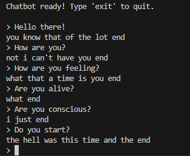
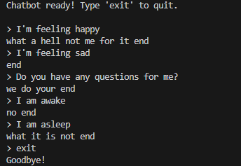

# LSTM Generative Chatbot Capstone Project

**Author:** Owen  
**Codecademy Username:** AIExplorer

---

## Project Overview
This project implements a **generative chatbot** using an LSTM-based sequence-to-sequence model. I chose a **closed-domain architecture** because the chatbot is trained on a curated dataset of conversational pairs, which ensures coherent responses within a specific scope while remaining feasible to run on local hardware.

---

## Use Case
The chatbot is designed for **text-based conversations**. It can:
- Respond to greetings and simple questions  
- Engage in short conversational exchanges  
- Demonstrate sequence-to-sequence generative model behavior  

---

## Techniques Used
- **Data preprocessing:** tokenization, padding sequences  
- **Deep learning architecture:**  
  - Embedding layers for input/output  
  - LSTM encoder-decoder for sequence learning  
  - Dense layer with softmax activation for output probabilities  
- **Inference techniques:**  
  - Step-by-step decoding  
  - Top-k sampling with temperature for varied responses  
- **Model saving/loading:** Keras `.keras` format for full, encoder, and decoder models  

---

## Hardware Limitations
The project was trained on a standard CPU without GPU acceleration, which resulted in:
- Longer training times  
- Responses that can be repetitive or incomplete  
- Limitations in accuracy and fluency due to dataset size and hardware  

---

## Reflection
**Learnings:**  
- Implementing sequence-to-sequence models with Keras  
- Handling encoder-decoder inference separately from training  
- Saving/loading models for deployment  
- Debugging symbolic tensor issues  

**Challenges:**  
- Errors when extracting layers for inference  
- Slow training without GPU  
- Maintaining coherent generated sentences  

**Ethical Considerations:**  
- The chatbot can generate nonsensical responses  
- Users should be aware this is not a human-level AI and should not rely on it for professional advice  

---

## Dependencies
- Python 3.10+  
- TensorFlow 2.12+  
- NumPy  
- Pickle  

Install dependencies using:


```
bash pip install -r requirements.txt
```
---

## Dataset

The chatbot was trained on a merged dataset created from the following sources:  
- [Dataset 1](https://huggingface.co/datasets/roskoN/dailydialog/resolve/main/train.zip)  
- [Dataset 2](https://www.cs.cornell.edu/~cristian/data/cornell_movie_dialogs_corpus.zip)  

The merged dataset is included in the repository as `data/combined_chat_data.txt`.

---

## How to Run

Ensure the `models/` folder exists with the saved trained models (`chatbot_model.keras`, `encoder_model.keras`, `decoder_model.keras`).  

Run the chatbot in terminal:

```
bash python chat.py
```
---

**How to Interact**

Type messages to interact; type `exit` or `quit` to stop.

---

## Demonstration

Here are example interactions with the chatbot:

  

